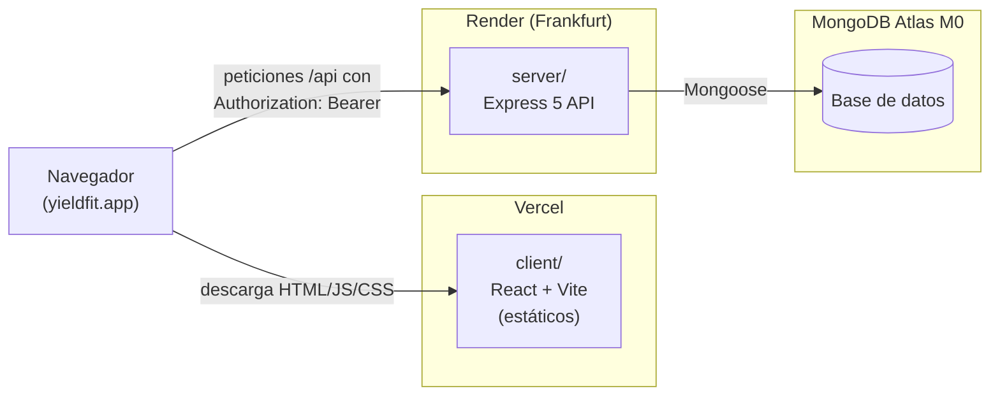
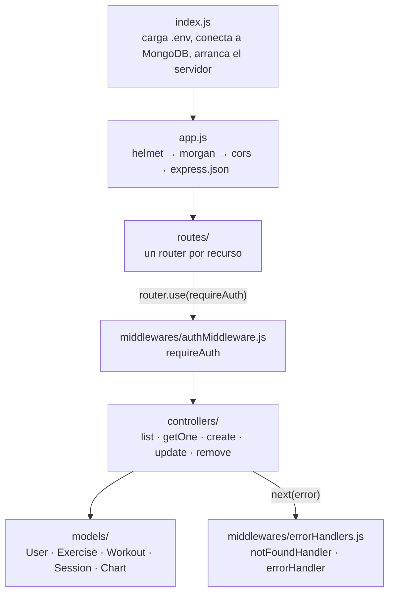
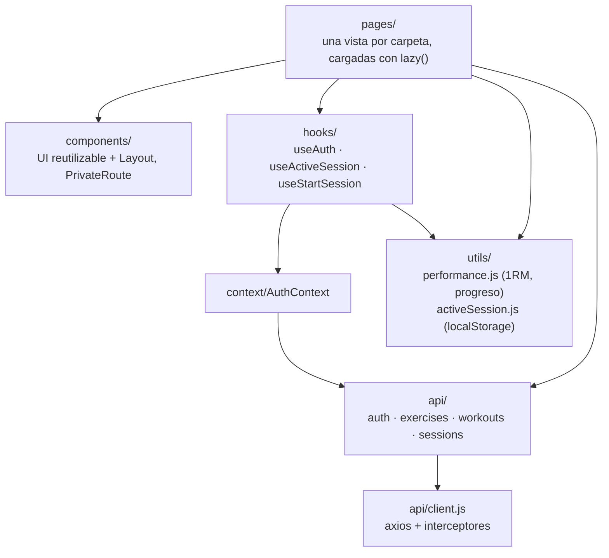
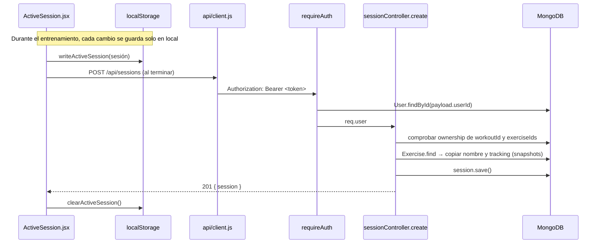

# Arquitectura

[← Índice](README.md)

## Despliegue

Tres piezas independientes, cada una en un servicio con plan gratuito ([0001](../DECISIONS.md)).
El frontend y el backend se despliegan por separado desde el mismo repo (`client/` y `server/`).

- El navegador descarga la app de Vercel y después habla **directamente** con la API de Render.
  Por eso son dos dominios distintos y la API necesita CORS (`CLIENT_ORIGINS`).
- **Cold start:** Render duerme el servicio tras un periodo sin tráfico; la primera petición
  tarda decenas de segundos. Se aborda en el bloque 3.

## Backend (`server/`)

| Prefijo | Router | Protección |
|---|---|---|
| `/api/auth` | `authRoutes.js` | pública, salvo `GET /me` |
| `/api/exercises` | `exerciseRoutes.js` | `requireAuth` a nivel router |
| `/api/workouts` | `workoutRoutes.js` | `requireAuth` a nivel router |
| `/api/sessions` | `sessionRoutes.js` | `requireAuth` a nivel router |
| `/api/charts` | `chartRoutes.js` | `requireAuth` a nivel router (sin uso en el cliente todavía) |

Todos los recursos siguen el mismo patrón: cada query filtra por `userId: req.user._id` y, cuando
un documento referencia otros ids (`exerciseId`, `workoutId`), el controlador comprueba que
pertenecen al usuario antes de guardar.

## Cliente (`client/src/`)

- **`api/client.js`** es el único punto que habla con el backend: añade el token en cada
  petición y, si recibe un 401, borra el token y manda a `/login` (ver [auth.md](auth.md)).
- **Lógica de negocio fuera de los componentes:** el cálculo del 1RM y del progreso vive en
  `utils/performance.js` ([0007](../DECISIONS.md)); la sesión en curso, en
  `utils/activeSession.js` ([0009](../DECISIONS.md)).
- **Fondos WebGL** ([0011](../DECISIONS.md)): `Dither` solo en Welcome (carga diferida);
  `DarkVeil` dentro de `Layout`, así que está en todas las pantallas privadas.

### Rutas

| Ruta | Página | Privada |
|---|---|---|
| `/` | Welcome | no |
| `/login`, `/register` | Login, Register | no |
| `/dashboard` | Dashboard | sí |
| `/exercises`, `/exercises/new`, `/exercises/:id/edit` | Exercises, ExerciseForm | sí |
| `/workouts`, `/workouts/new`, `/workouts/:id/edit` | Workouts, WorkoutForm | sí |
| `/sessions/active` | ActiveSession | sí |
| `/history`, `/history/:id` | History, SessionDetail | sí |
| `/profile` | Profile | sí |

Las rutas privadas van envueltas en `PrivateRoute` + `Layout`. Cualquier otra ruta redirige a `/`.

## Recorrido de una petición: guardar una sesión

