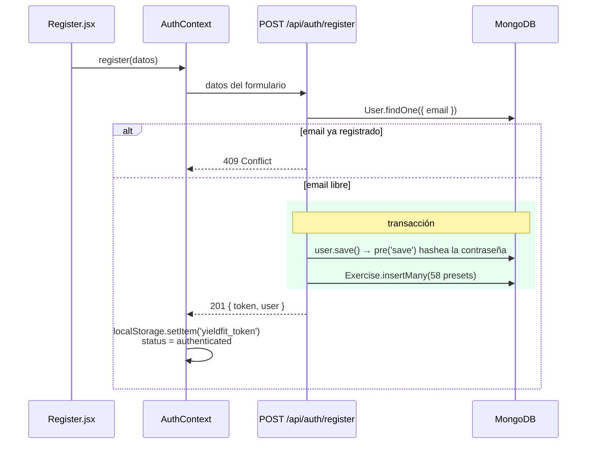
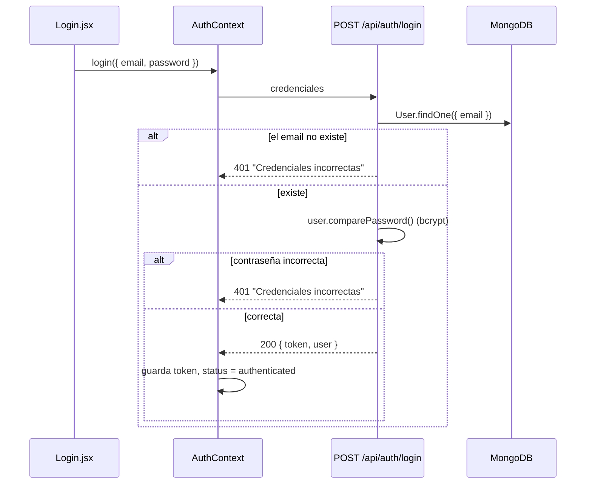
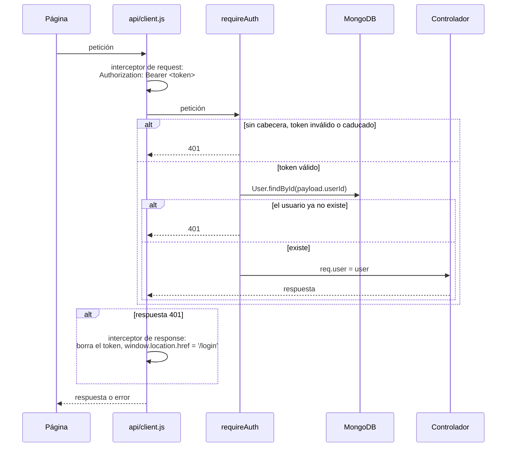
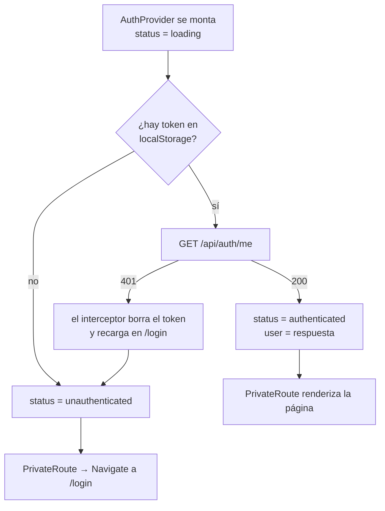

# Autenticación

[← Índice](README.md)

JWT stateless: el backend no guarda sesiones. Firma un token con `{ userId }` y 7 días de
validez, y el cliente lo guarda en `localStorage` (`yieldfit_token`) y lo envía en cada petición
([0008](../DECISIONS.md)).

| Pieza | Archivo | Qué hace |
|---|---|---|
| Firmar y verificar | `server/utils/jwt.js` | `signToken(userId)`, `verifyToken(token)` con `JWT_SECRET` |
| Endpoints | `server/controllers/authController.js` | `register`, `login`, `me` |
| Proteger rutas | `server/middlewares/authMiddleware.js` | `requireAuth`: valida el token y carga `req.user` |
| Guardar y enviar el token | `client/src/api/client.js` | interceptores de axios |
| Estado de sesión | `client/src/context/AuthContext.jsx` | `status`: `loading` → `authenticated` / `unauthenticated` |
| Rutas privadas | `client/src/components/PrivateRoute.jsx` | redirige a `/login` si no hay sesión |

## Registro

El usuario y sus ejercicios se crean en una **transacción**: o se guardan los dos, o ninguno
([0002](../DECISIONS.md)). El registro ya devuelve un token, así que el usuario queda logueado
sin pasar por `/login`.

## Login

El mensaje de error es **el mismo** para "email no existe" y "contraseña incorrecta", para no
revelar qué emails están registrados.

## Peticiones protegidas

`requireAuth` consulta la base de datos en cada petición. Tiene un coste, pero hace que un
usuario borrado deje de tener acceso aunque su token no haya caducado.

## Al abrir la app

Mientras `status = loading`, `PrivateRoute` muestra "Cargando...". Con el cold start de Render
esto puede durar decenas de segundos: es lo que resuelve el bloque 3.

## Cerrar sesión

No hay endpoint: como el JWT es stateless, basta con borrar el token del cliente. La contrapartida
es que un token robado sigue siendo válido hasta que caduca.

## Limitaciones conocidas

- Token en `localStorage`: legible por JavaScript si hubiera un XSS.
- Sin refresh token ni revocación. Auth robusta en el bloque 11; almacenamiento seguro nativo en
  iPhone en el bloque 12.
- Sin rate limiting en `/login`.
- El mismo mensaje de error no impide del todo saber si un email existe: cuando no existe, la
  respuesta llega antes porque se salta bcrypt, que es lento a propósito. Es una enumeración por
  tiempo de respuesta; conviene tenerla en cuenta en el bloque 11.
- El interceptor 401 usa `window.location.href`, que recarga la app entera. Se sustituye por
  navegación de React Router en el bloque 3.
