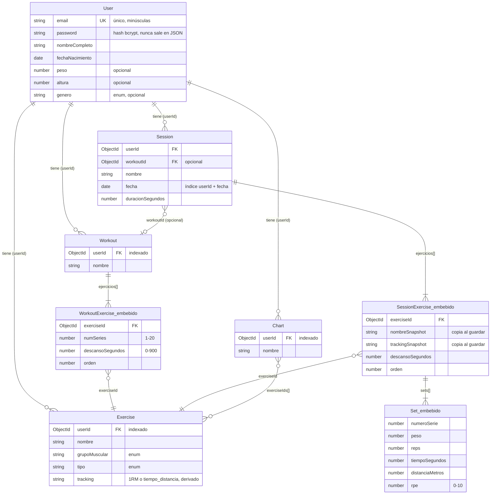
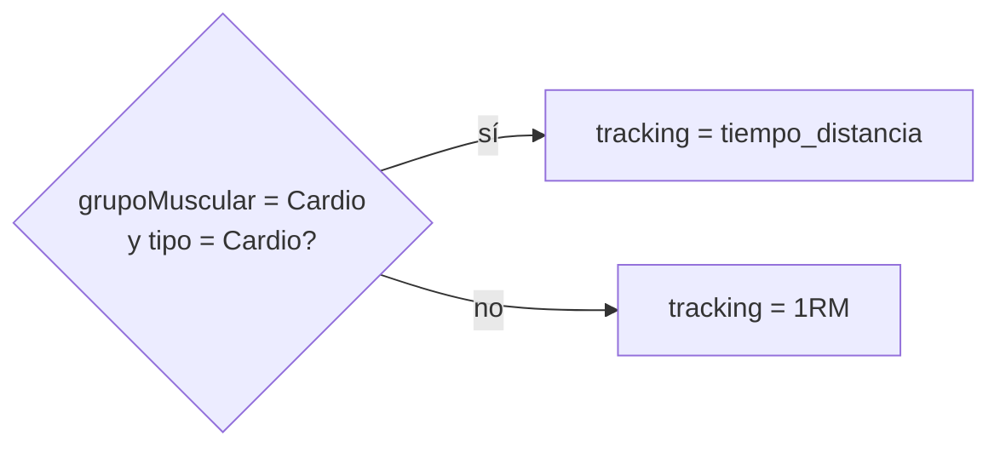
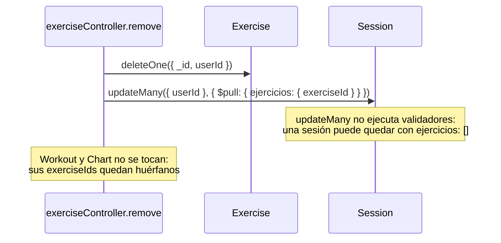

# Modelo de datos

[← Índice](README.md)

Cinco colecciones en MongoDB (una por modelo de Mongoose en `server/models/`). La regla de
diseño ([0003](../DECISIONS.md)): **embeber lo que se lee junto al padre y referenciar lo que
existe de forma independiente**.

## Diagrama

Las entidades marcadas como *embebido* no son colecciones: viven dentro del documento padre.

Todos los modelos tienen además `createdAt` y `updatedAt` (`timestamps: true`).

## Modelos

### User
- La contraseña se hashea con bcrypt en `pre('save')`, solo si ha cambiado (`isModified`).
- `toJSON` borra `password`, así que nunca sale en una respuesta de la API.
- `comparePassword()` se usa en el login (ver [auth.md](auth.md)).

### Exercise
- **Por usuario:** al registrarse, se clonan 58 presets de `server/data/exercisePresets.js`
  ([0002](../DECISIONS.md)).
- `grupoMuscular` y `tipo` son enums. ⚠️ Están duplicados a mano en
  `client/src/pages/ExerciseForm/ExerciseForm.jsx` (deuda técnica).
- `tracking` no lo elige el usuario: lo calcula `pre('save')` ([0006](../DECISIONS.md)).

⚠️ Esta regla está **duplicada** en `derivarTracking` (`authController.js`), porque el clonado de
presets usa `insertMany`, que no ejecuta `pre('save')`. Si cambia la regla, hay que cambiarla en
los dos sitios.

### Workout
Plantilla de rutina. `ejercicios[]` embebido, con al menos 1 elemento (validador del schema).

### Session
Entrenamiento realizado.
- `ejercicios[]` (al menos 1) y, dentro de cada uno, `sets[]` (al menos 1).
- **Snapshots** ([0004](../DECISIONS.md)): al crear la sesión, el controlador lee cada
  `Exercise` y copia `nombre → nombreSnapshot` y `tracking → trackingSnapshot`. Así, renombrar
  un ejercicio no cambia el historial.
  ⚠️ `PUT /api/sessions/:id` vuelve a generar los snapshots si recibe `ejercicios`, así que una
  sesión editada tomaría los nombres actuales. El cliente no usa ese endpoint; se resuelve en el
  bloque 1.
- **Índice `{ userId: 1, fecha: -1 }`:** sirve para listar las sesiones de un usuario de la más
  reciente a la más antigua, que es la query de `GET /api/sessions`.

### Chart
Grupo de ejercicios para el progreso (`nombre`, `exerciseIds[]`). CRUD hecho en el backend,
**sin uso en el cliente todavía** (bloque 9).

## Borrar un ejercicio: cascada `$pull`

Decisión de producto ([0005](../DECISIONS.md)): si el usuario borra un ejercicio, no quiere que
aparezca en su progreso histórico.

Las tres consecuencias (sesiones vacías, borrado sin aviso, ids huérfanos) se resuelven en el
bloque 1.

## Qué crece con el tiempo

Según el principio de estabilidad ([0015](../DECISIONS.md)), lo que importa es qué colecciones
crecen sin límite:

| Colección | Crecimiento | Estado |
|---|---|---|
| Session | una por entrenamiento, indefinidamente | indexada; **`GET /api/sessions` sin paginar** (bloque 4) |
| Exercise | ~58 + los que cree el usuario | acotada |
| Workout, Chart | pocas por usuario | acotadas |
